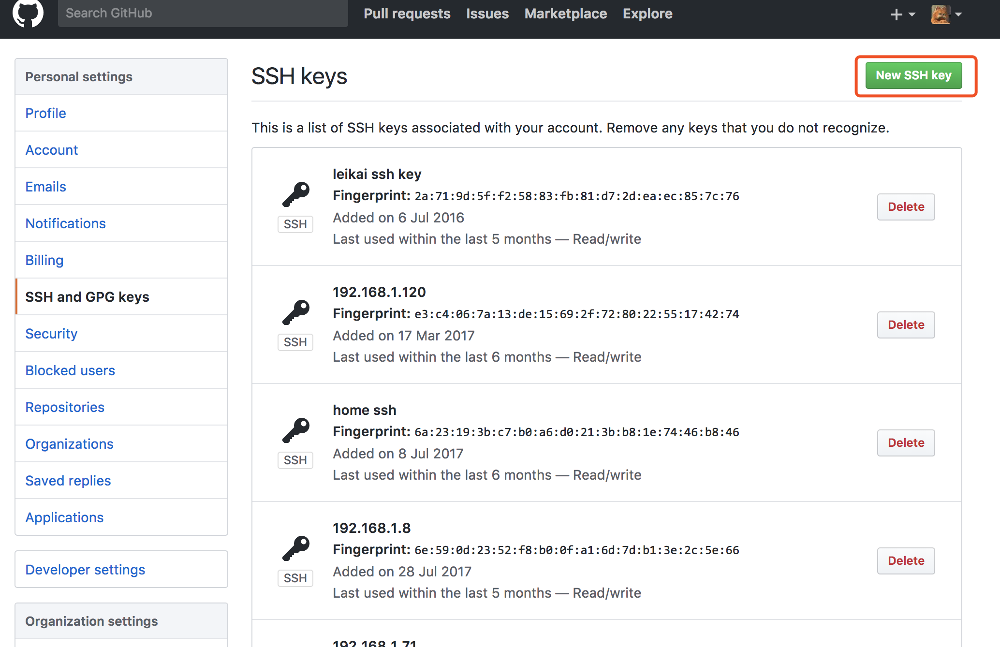
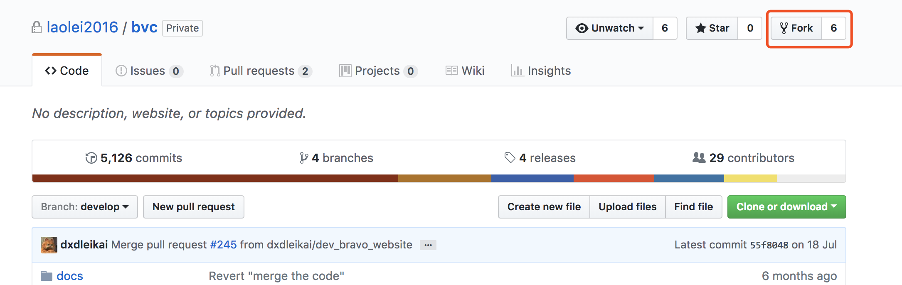
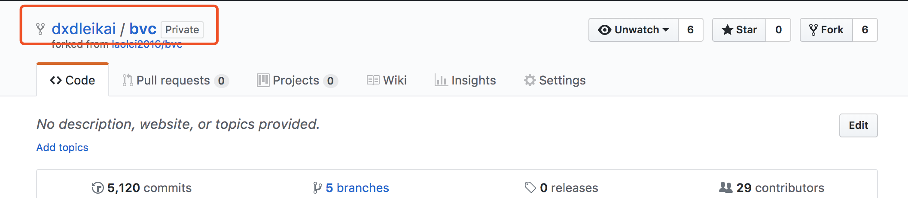
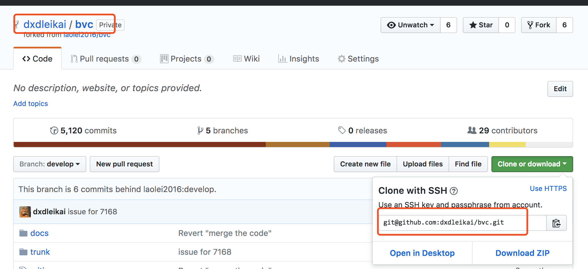
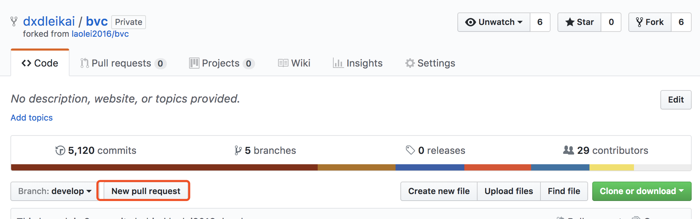

## Git基本操作入门

----------

### 安装客户端
- mac
```
$ brew install git
```

- CentOS
```
$ yum install git
```

- Debian/Ubuntu
```
$ apt-get install git
```

---------

### 配置
- 用户名
```
$ git config [--global] user.name "[name]"
$ git config [--global] user.email "[email address]"
```
- 快捷键
```
$ git config --global alias.co checkout
$ git config --global alias.br branch
$ git config --global alias.ci commit
$ git config --global alias.st status
```

--------

### 基本概念

-------

- Working directory：工作区
- (Staging)Index directory：暂存区
- Local repository：本地仓库
- Remote repository：远端仓库

--------


### 创建新仓库
```
$ cd your_work_space
$ touch README.md
$ git init
$ git add README.md
$ git commit -m "first commit"
$ git remote add origin https://github.com/dxdleikai/plan.git
$ git push -u origin master
```

--------

### 检出仓库
- 本地仓库
```
$ git clone /path/to/repository
```
- 远端仓库
如仓库在github, 可以查询具体的路径
```
$ git clone username@host:/path/to/repository
```

---------

### 添加和提交
- 将改动内容添加到缓存区，这和svn用法稍微有点不同
```
$ git add your_modify_file
```

- 提交改动到本地仓库
```
$ git commit -m "What's the issue to fix"
```

--------

### 推送修改
- 推动改动到远端仓库，master可以换为任何分支
```
$ git push origin master
```
- 添加远端仓库, 将改动推送到这个仓库
```
$ git push origin master
```
- 上传本地指定分支到远程仓库
```
$ git push [remote] [branch]
```

-----------

### 创建分支

1. 创建一个名为"feature_x"的分支，并切换过去：
```
$ git checkout -b feature_x
```
2. 切回主分支：
```
$ git checkout master
```

3. 切换到指定分支

```
$ git checkout [branch]
```

4. 将分支推送到远端仓库, 不推送该分支，就仅自己所见
```
$ git push origin branch
```

-----------

### 分支查询

```
$ git branch -d feature_x
```
5. 列出所有本地分支

```
$ git branch
```
6. 列出所有远端分支

```
$ git branch -r
```
7. 列出所有本地和远端分支

```
$ git branch -a
```

----------

### 更新

- 下载远程仓库的所有变动
```
$ git fetch [remote]
```

- 更新本地仓库到最新改动
```
$ git pull
```
在你的工作目录中获取（fetch）并合并（merge）远端的改动。

- 下载远程仓库的所有变动
```
$ git pull [remote] [branch]
```

-----------

### 合并

- 合并其他分支到当前分支（如master）
```
$ git merge [branch]
```

- 修改完冲突后，需要加入改动

```
$ git add your_modify_fle
```

- 上传本地指定分支到远程仓库
```
$ git push [remote] [branch]
```

------------

### 创建tag
- 列出所有tag
```
$ git tag
```

- 创建一个2.0.1到tag
```
$ git log
$ git tag 2.0.1 your_tag_git_id
```

- 删除本地tag
```
$ git tag -d [tag]
```

- 删除远端tag
```
$ git push origin :refs/tags/[tagName]
```

- 查看tag信息
```
$ git show [tag]
```

--------------

### 恢复本地修改
- 替换本地改动
```
$ git checkout -- <filename>
```

- 丢弃本地所有改动
```
$ git reset --hard HEAD
```

- 回退到历史版本
```
$ git reset --hard 0d18e997d6c2f4daf57340de0d18d7e3897f15e1
```

----------

### git查询

- 显示有变更的文件
```
$ git status
```

- 显示当前分支的版本历史
```
$ git log
```

- 显示暂存区和工作区的差异
```
$ git diff
```

- 显示当前分支的最近几次提交
```
$ git reflog
```

-------------

### ssh 签名
```
$ cd
$ ssh-keygen
$ cat .ssh/id_dsa.pub
```

-------------

### 开始使用
- [注册帐号](https://github.com/)
- 权限申请, ssh key导入




--------------

- 克隆到自己仓库


---------------



---------------

- 修改和提交到自己的仓库


---------------

- 页面提交pull request
- CR通过后，合并到远端服务器



-----------

### 参考链接
* [Pro Git(en)](https://git-scm.com/book/en/v2) - git入门必读(英文）
* [Pro Git(zh)](https://git-scm.com/book/zh/v2) - git入门必读(中文）
* [Tech Talk](https://www.youtube.com/watch?v=4XpnKHJAok8) - Linus Torvalds on git